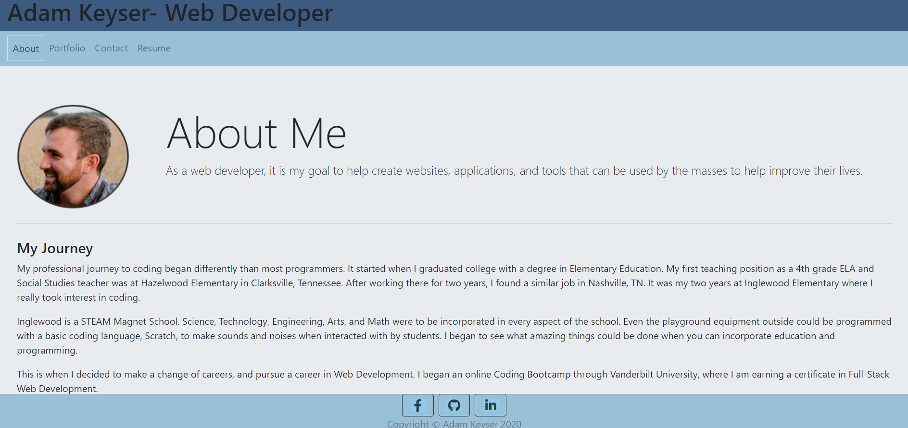

# Adam Keyser's Professional Portfolio
The Professional Portfolio for Adam Keyser.

## Description: 
This is an online Portfolio for Adam Keyser. On it you can learn more about Adam Keyser and his Coding Abilities. The application is divided into 4 sections:

* About
A brief description of myself, and my journey to learn coding and web development.
* Portfolio
A list of some of my coding projects, with pictures and links to their repositories and deployed applications.
* Contact
A contact form to send me emails.
* Resume
A list of my current web development skills, as well as a link to download my resume.

## How It's Made:
This website was made using React. The pages and their parts are divided up into different components that are used dynamically in the website. The styling of the page uses a mix of Bootstrap and customized CSS. 

## Link to Deployed App
https://adamkeyser45.github.io/professional_portfolio/